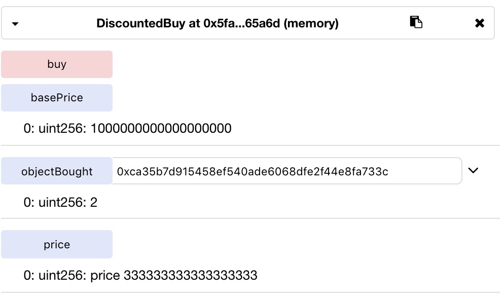

## 1. SimpleToken

```Solidity
function sendToken(address _recipient, uint _amount) {
    require(balances[msg.sender]!=0); // You must have some tokens.
    
    balances[msg.sender]-=_amount;
    balances[_recipient]+=_amount;
}
```
### Problem

Function `sendToken` only checks if the `msg.sender` has a non-zero balance. Thus we can exploit this check by calling sendToken from one account with 1 token, to send to another address that we own an arbitrarily large amount of tokens.


After the exploit, both the sender and recipient addresses can be given a very large number of tokens. The recipient address will have its balance increase by the amount sent to it, while the sender address will have its balance uint underflow. As a result, its value will equal to 
```Solidity
  2^256 - 1 - (_amount + balance[msg.sender])
``` 
which can also be manipulated to be however small or large. 

### Fix

Change the require statement to: `require(balances[msg.sender]>=_amount);`


**Does this count as two vulnerabilities in the same contract?**

## 2. VoteTwoChoices

```Solidity 
function vote(uint _nbVotes, bytes32 _proposition) {
    require(_nbVotes + votesCast[msg.sender]<=votingRights[msg.sender]); // Check you have enough voting rights.
    
    votesCast[msg.sender]+=_nbVotes;
    votesReceived[_proposition]+=_nbVotes;
}
```

### Problem

With the same problem of not using SafeMath, the value `votesReceived[_proposition]` can also be underflown. In this case, we can get past the `require` check by first voting for one proposition, increasing the `votesCast[msg.sender]` by 1. 


Then we can pass a equally negative `_nbVotes` of -1 to vote on another proposition. This would result in the second proposition's `votesReceived[_proposition]` to be underflown.


### Fix

Check the value of `_nbVotes` before addition:
requires(_nbVotes<=votingRights(msg.sender))

## 3. BuyTokens

```Solidity
function buyToken(uint _amount, uint _price) payable {
    require(_price>=price); // The price is at least the current price.
    require(_price * _amount * 1 ether <= msg.value); // You have paid at least the total price.
    balances[msg.sender]+=_amount;
}
```
### Problem

Again, not using SafeMath, we can try to over/underflow some uints. In this case we want to get pass the two require checks, and underflow the value of `balances[msg.sender]`. We can do so by passing both `_amount` and `_price` as -1. Underflow of `_price` will make it larger than `price`. Then,  `_price * _amount * 1 ether` negates the negation, and we only need to spend 1 ether to pass this check.

In the end, we end up with `2^256 - 2` in our balance.


### Fix

Use the SafeMath library to perform math operations.

## 4. Store

```Solidity
function store() payable {
    safes.push(Safe({owner: msg.sender, amount: msg.value}));
}

function take() {
    for (uint i; i<safes.length; ++i) {
        Safe safe = safes[i];
        if (safe.owner==msg.sender && safe.amount!=0) {
            msg.sender.transfer(safe.amount);
            safe.amount=0;
        }
    }
}
```
### Problem

In `store()` function there is no check on the value of message. Thus the use of structs in an array to store each safe's owner and amount can be exploited. This is because a new safe is pushed to the array everytime and the `take()` function needs to loop through a longer array after every new safe is stored. 

As this array grows in size, the take function consumes more and more gas. Therefore an attacker can spam the contract by sending lots of message with 0 value to the `store()` function, creating many entries of 0 in the array.

Also, although transfer() is used instead of call.value(), it is still better practice to transfer the amount after setting the amount to 0. 

### Fix

1. Use a require statement in `store()` to check that `msg.value >= 0`. 
2. Use a mapping instead of an array which has constant lookup time. The `msg.sender` can be used as the key of the mapping,and each call of the store function can add the amount to the existing value in the mapping.
3. Change `take()` function to transfer the amount after setting the amount to 0. We can use `require(msg.sender.transfer(safe.amount))` to make sure the transfer succeeds or else the amount is not changed.

## 5. CountContribution

```Solidity
function recordContribution(address _user, uint _amount) {
    contribution[_user]+=_amount;
    totalContributions+=_amount;
}
```
### Problem

There is no visibility specified for this function, so it is public by default. Therefore anyone can freely record any number of contributions for themselves or others, without needing to pay.


### Fix

Change visibility of `recordContribution` function to private, so that it can only be called within this contract. 


## 6. Token

```Solidity
function sendAllTokens(address _recipient) {
    balances[_recipient]=+balances[msg.sender];
    balances[msg.sender]=0;
}
```

### Problem

This function has a syntax error that does not cause a compile error. The operator `=+` is used instead of `+=`. This produces a bug where `sendAllTokens` sets the balance of the recipient to the balance of the sender instead of adding that amount to their original balance.

*Potentially a way to overflow the `sendTokens` function as well?*


### Fix

Change `=+` to `+=`

## 7. DiscountedBuy

```Solidity
function buy() payable {
        require(msg.value * (1 + objectBought[msg.sender]) == basePrice);
        objectBought[msg.sender]+=1;
    }
```

### Problem

Price calculation in `buy()` is not accurate. After purchasing 2 objects price returned by `price()` function equals 333333333333333333 wei. However, in the `require` check of function `buy()`, 333333333333333333 * (1+2) does not equal to `basePrice` = 1



### Fix

Only discount prices when the number of objects is divisable by 2. Thus all calculations can be exact.

## 8. HeadOrTail

```Solidity
bool lastChoiceHead; // True if the choice is head.
```

### Problem

Although the default visibility of the boolean `lastChoiceHead` is private, its value can still be seen by the public. This can be done easily by using web3: `web3.eth.getStorageAt(address, location)`. Thus the second player can always guarantee a win over the first player. 

### Fix

Keeping secrets on solidity requires encryption. Although in this case, it is hard to automate the game process on-chain, as both parties are competing against each other.

A potential implementation could be to have both players encrypt their choice of `head` or `tail` with a third-party's public key, and submitting them separately to the contract. The third-party would then settle the result off-chain by decrypting both messages with its private key, and comparing the choices. 

## 9. Vault

## 10. HeadTail