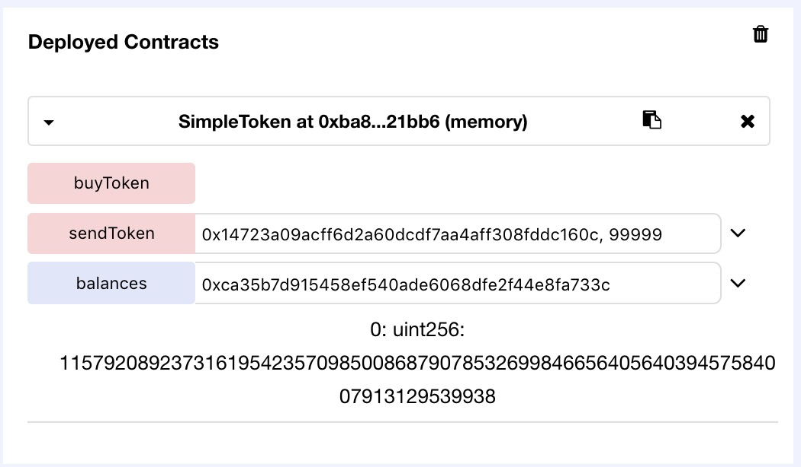

## 1. SimpleToken

```
function sendToken(address _recipient, uint _amount) {
    require(balances[msg.sender]!=0); // You must have some tokens.
    
    balances[msg.sender]-=_amount;
    balances[_recipient]+=_amount;
}
```

Function `sendToken` only checks if the `msg.sender` has a non-zero balance. Thus we can exploit this check by calling sendToken from one account with 1 token, to send to another address that we own an arbitrarily large amount of tokens.




After the exploit, both the sender and recipient addresses can be given a very large number of tokens. The recipient address will have its balance increase by the amount sent to it, while the sender address will have its balance uint underflow. As a result, its value will equal to 
```
  2^256 - 1 - (_amount + balance[msg.sender])
``` 
which can also be manipulated to be however small or large. 

**Does this count as two vulnerabilities in the same contract?**

## 2. VoteTwoChoices

``` 
function vote(uint _nbVotes, bytes32 _proposition) {
    require(_nbVotes + votesCast[msg.sender]<=votingRights[msg.sender]); // Check you have enough voting rights.
    
    votesCast[msg.sender]+=_nbVotes;
    votesReceived[_proposition]+=_nbVotes;
}
```

With the same problem of not using SafeMath, the value `votesReceived[_proposition]` can also be underflown. In this case, we can get past the `require` check by first voting for one proposition, increasing the `votesCast[msg.sender]` by 1. 


Then we can pass a equally negative `_nbVotes` of -1 to vote on another proposition. This would result in the second proposition's `votesReceived[_proposition]` to be underflown.


## 3. BuyTokens

``` 
function buyToken(uint _amount, uint _price) payable {
    require(_price>=price); // The price is at least the current price.
    require(_price * _amount * 1 ether <= msg.value); // You have paid at least the total price.
    balances[msg.sender]+=_amount;
}
```

Again, not using SafeMath, we can try to over/underflow some uints. In this case we want to get pass the two require checks, and underflow the value of `balances[msg.sender]`. We can do so by passing both `_amount` and `_price` as -1. Underflow of `_price` will make it larger than `price`. Then,  `_price * _amount * 1 ether` negates the negation, and we only need to spend 1 ether to pass this check.


In the end, we end up with `2^256 - 2` in our balance.

## 4. Store

transfer() is used instead of call.value(), so how to attack? Any other vulnerabilities other than reentrancy?

## 5. CountContribution

```
function recordContribution(address _user, uint _amount) {
    contribution[_user]+=_amount;
    totalContributions+=_amount;
}
```

There is no visibility specified for this function, so it is public by default. Therefore anyone can freely record any number of contributions for themselves or others, without needing to pay.


## 6. Token

```
function sendAllTokens(address _recipient) {
    balances[_recipient]=+balances[msg.sender];
    balances[msg.sender]=0;
}
```

This function has a syntax error that does not cause a compile error. The operator `=+` is used instead of `+=`. This produces the bug where `sendAllTokens` sets the balance of the recipient to the balance of the sender instead of adding that amount to their original balance.

*Potentially a way to overflow the `sendTokens` function as well?*


## 7. DiscountedBuy

## 8. HeadOrTail

## 9. Vault

## 10. HeadTail